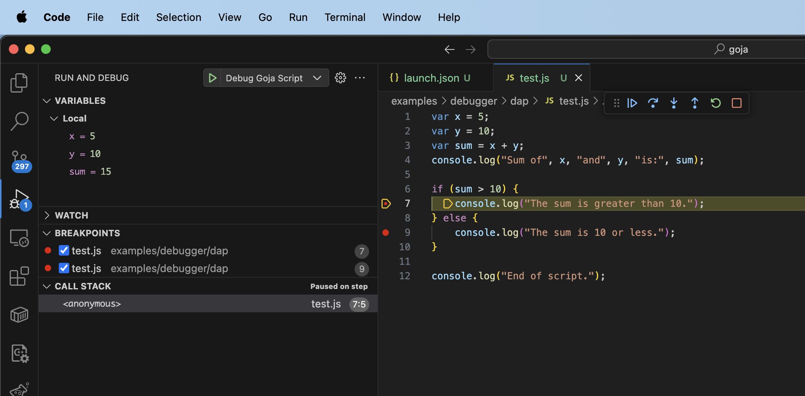
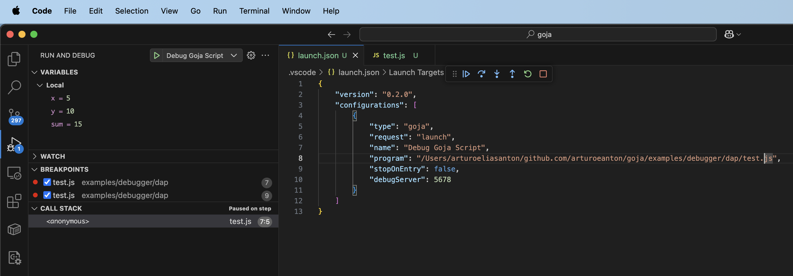

# Goja Debug POC

This is a Proof of Concept (POC) for debugging JavaScript code running in the [Goja](https://github.com/dop251/goja) JavaScript runtime using the Debug Adapter Protocol (DAP) and Visual Studio Code.

> ⚠️ **Note**: This is a POC and is not intended to be 100% functional. It demonstrates the core concept of debugging Goja scripts in VS Code.

## Overview

This project consists of two main components:
1. **DAP Server** (`dap/`): A Go-based Debug Adapter Protocol server that interfaces with a modified Goja runtime
2. **VS Code Extension** (`gojs/`): A Visual Studio Code extension that provides debugging capabilities for Goja scripts

## Prerequisites

- Go 1.20 or later
- Node.js and npm
- Visual Studio Code
- `vsce` (Visual Studio Code Extension Manager): `npm install -g vsce`

## Setup Instructions

### 1. Clone and Initialize

```bash
git clone https://github.com/arturoeanton/goja-debug-poc.git
cd goja-debug-poc
```

### 2. Build the DAP Server

```bash
cd dap
./build.sh
```

This will create the `gojs` binary that acts as both the JavaScript runtime and the DAP server.

### 3. Build and Install the VS Code Extension

```bash
cd ../gojs
npm install
npm run compile
vsce package
```

This creates a `goja-debug-0.0.1.vsix` file. Install it in VS Code:

```bash
code --install-extension goja-debug-0.0.1.vsix
```

### 4. Configure VS Code Debugging

Create a `.vscode/launch.json` file in your project root:

```json
{
    "version": "0.2.0",
    "configurations": [
        {
            "type": "goja",
            "request": "attach",
            "name": "Attach to Goja",
            "debugServer": 5678
        },
        {
            "type": "goja",
            "request": "launch",
            "name": "Debug Goja Script",
            "program": "${workspaceFolder}/script.js",
            "stopOnEntry": false,
            "debugServer": 5678
        }
    ]
}
```

## Usage

### Running Scripts Normally

```bash
cd dap
./gojs test.js
```

### Debugging Scripts

#### Method 1: Attach Mode
1. Start the script in debug mode:
   ```bash
   ./gojs -d -f test.js
   ```
2. Open VS Code in the project folder
3. Set breakpoints in your JavaScript file
4. Press `F5` and select "Attach to Goja"

#### Method 2: Launch Mode  
1. Open VS Code in the project folder
2. Set breakpoints in your JavaScript file
3. Press `F5` and select "Debug Goja Script"

### Custom Debug Port

```bash
./gojs -d -port 9000 -f test.js
```

Remember to update the `debugServer` port in your launch configuration accordingly.

## Demo Screenshots

### Debugging Session in VS Code


### Breakpoint and Variable Inspection


## Features

- ✅ **Breakpoints**: Set breakpoints in JavaScript code
- ✅ **Stepping**: Step into, over, and out of functions
- ✅ **Call Stack**: View the current execution stack
- ⚠️ **Variables**: Basic variable inspection (simplified implementation)
- ✅ **Console Output**: View console.log output in VS Code
- ⚠️ **Expression Evaluation**: Limited support for evaluating expressions

## Architecture

The implementation follows the Debug Adapter Protocol specification:

1. **Launch/Attach**: VS Code connects to the DAP server
2. **Breakpoints**: VS Code sends breakpoint locations to the adapter
3. **Execution Control**: The adapter controls the Goja runtime execution
4. **Events**: The adapter sends stopped/continued/terminated events
5. **Stack/Variables**: VS Code requests runtime information when paused

## Known Limitations

This is a POC with several limitations:

- Variable inspection is simplified and may not show all object properties
- No support for conditional breakpoints
- Single-threaded execution only
- No hot reload support
- Limited expression evaluation in debug console
- Error handling is basic
- Performance is not optimized

## Technical Details

### Modified Goja Runtime

This POC uses a fork of Goja with debugging capabilities:
- Repository: `github.com/arturoeanton/goja`
- Adds debugger hooks and breakpoint support
- Provides stepping and execution control APIs

### File Structure

```
├── dap/                    # DAP Server implementation
│   ├── adapter.go         # Main DAP adapter logic
│   ├── protocol.go        # DAP protocol messages
│   ├── main.go           # Entry point and CLI
│   └── gojs.go           # Goja runtime wrapper
├── gojs/                  # VS Code extension
│   ├── src/
│   │   ├── extension.ts   # Extension activation
│   │   └── gojaDebug.ts   # Debug adapter implementation
│   └── package.json       # Extension manifest
└── test*.js              # Sample JavaScript files for testing
```

## Troubleshooting

### Common Issues

1. **Port already in use**: Use `-port` flag with a different port
2. **Can't connect**: Ensure the DAP server is running before starting the VS Code debugger
3. **No breakpoints hit**: Verify file paths match between debugger and runtime
4. **Extension not found**: Make sure the `.vsix` file is properly installed

### Debug Output

Enable debug output by setting environment variables:
```bash
DEBUG=1 ./gojs -d -f test.js
```

## Contributing

This is a POC project. Feel free to experiment and improve upon it:

1. Enhanced variable inspection
2. Better error handling
3. Conditional breakpoints
4. Watch expressions
5. Multi-file debugging support

## License

This project is provided as-is for demonstration purposes. See the individual component licenses for specific terms.